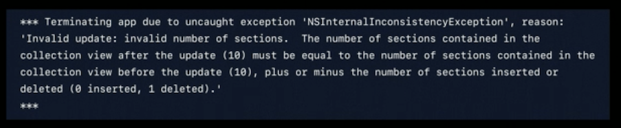

# Diffable Data Sources


Some links to read

* [Tableview Docs](https://developer.apple.com/documentation/uikit/uitableviewdiffabledatasource)
* [Collectionview Docs](https://developer.apple.com/documentation/uikit/uicollectionviewdiffabledatasource)
* WWDC 19 session [Advances in UIDataSources](https://developer.apple.com/videos/play/wwdc2019/220/)
* [combine + diffable data sources (thoughtbot)](https://thoughtbot.com/blog/combine-diffable-data-source)
* [A first look (sundell)](https://wwdcbysundell.com/2019/diffable-data-sources-first-look/)
* WWDC 20 session [Advances in Diffable Data Sources](https://developer.apple.com/videos/play/wwdc2020/10045/)

Also

* [X] revisit use in MusicJot
* Adapt to Borkle?
* Life with diffable?
* paginated infinite data sources?
* CollectionDifference from stdlib

----------

But first, SPELUNK THE HEADERS.

* exists NS and UI Diffable data source headers
* looks like the same NSDiffableDataSourceSnapshot stuff, with extra frobs
  for UIKit/AppKit

### NSDiffableDataSourceSnapshot

* "a representation of the state of the data in a view at a specific
  point in time"
* generic over `SectionIdentifierType` and `ItemIdentifierType`
    - where both of those types are Hashable.
* diffable data sources use _snapshots_ to provide data for collection views
  and table views
   - set up the initial state of the data in the view
   - later update that data
* the data is made of the sections and items you want to display.
  - in the specific order to display them
  - configure by adding / deleting / mving sections and items
* **Important** each of the sections anditems must have unique identifiers.


To display

* create a snapshot and populate it with the state of the data to display
* apply the snapshot to reflect the changes in the UI

Ways to create and configure a snapshot

* Make an empty one, then append sections and items
* get the current snapshot by calling the diffableDataSource's `snapshot`
  then modify to reflect the new state.

All identifiers must be unique.  Section and item identifers do not 
overlap and may contain values that exist in the other (like to
have a section ID of 1 and and item ID of 1)

_so looks like all item identifers have to be unique across everything,
so can't have same item identifier in two sections_

If you have duplication values in an item or section, exception.


### PropZ

Looks like this is dealing with just identifiers, not actually the real
data.

* array of section identifiers
* array of item identifiers

* number of items
* number of sections

* number of items in section (via identifeir)
* item identifiers (array) in a section (via identifier)
* section identifier for section containing an item identifier
* index of item / section identifier (NSNotFound if not present)

item operators

* append items with identifiers (array of identifiers)
* append items with identifers into section with an identifier

* insert items with identifiers before item (identifier)
* insert items with identifiers after item (identifier)

* delete items with identifiers (array)
* delete ALL items.

* move item with identifier before another item (via identifier)
* move item with identifier after another item

* reload items with identifiers

section operations

(reduced notes since it matches the patterns above)

* append sections with identifiers

* insert sections before / after
* delete sections with identifiers
* move section before/after
* reload sections with identifiers

[ ] what do RELOAD do? (guess it can only be called on the existing snapshot,
    not a new one)


"diffable data source item provider"

```
NSCollectionViewItem * (^NSCollectionViewDiffableDataSourceItemProvider)
     (NSCollectionView * _Nonnull,
      NSIndexPath * _Nonnull, 
      ItemIdentifierType _Nonnull);
```

So takes a collection view, an index path, and an item provider.  Returns
a collection view item.  So this is the gasket between the item identifiers
and the actual pile of data.

----------

Guessing we don't get the really cool stuff - given two snapshots,
do something with them.  is that all hidden inside of table/collection
view.

----------

Also NSDiffableDataSourceSectionSnapshot - looks like IOS14

"a representation fo the state of the data in a lyaout section
at a specific point in time"

NSDiffableDataSourceSectionSnapshot<ItemIdentifier>
where it's hashable

* represents the data for a single section in a collection view
or table view

* can use with or instead of a diffable data source snapshot
  - use when you need precise management of the data in a section 
    of your layout - like when sections acture the data from different
    sources.
  - also to representat data with a hierarchical structure
    - outline / expandable items

apply snaptshot to section animating differences.
  (the header has ascii art)

[ ] loop back to this one

----------

So, let's play with tableviews

ideas

* [X] insert something
* [X] sections with header
* [ ] type to filter

==================================================
Notes from WWDC sessions.

WWDC 2019 - advances in uidatasources

* current state of the art
* approach
* demos
* considerations


* interacting with table/collection views
  - number of sections / items in section / cell for item at
  - pretty straight forward
  - served us well - simple and flexible
  - flexible b/c don't need any particular data structure behind it

* apps mroe complicated
  - ui data sources backed by complex controllers.  Can do a lot
    of stuff
  - core data / web services
  - visualize with a controller / UI layer conversation
    1. UI->Controller number of items?
    2. web service request gets a response.  Got data for tweets!
    3. Controller -> UI didChange, something changed
    4. where things get more complex
    5. up to the UI layer. need to change this into updates for our
       layer.
    6. UI Layer: figure out all the mutations. 
       (covered last year in a Tour
       of collection view, and how to construct those batch updates)
       https://developer.apple.com/videos/play/wwdc2018/225/)
    7. sometimes how hard you try, (error message

    8. :-D  "you've probably hit this before".
    9. eventually get frustrated and just call reload data. that's
       fine.  You get this non-animated effect and detracts from
       UX.
   10. Philosophy - whats' the problem?  Where is our Truth™
       The data controller has its version. and the UI has a version
       of truth, and UI layer has responsibility of mitigating that
   11. Error prone approach b/c no centralized trooth

* A new Approach, Diffable Data Source
  1. A declarative to UI state
  2. no performBatchUpdates (crashes, hassles, complexity),
  3. repalced with apply
  4. Via a snapshot - truth of the _current_ UI state.
  5. collection of unique IDs for sections for items, rather than
     index paths
  6. Foo / Bar / Bif current stanpshop. new truth is Bar Foo Baz
  7. how do we get there?
  8. some changed order, a new item coming in, and one going out
  9. apply know about the current and new state

* Four classes
  - UI/NSCollectionView DiffableDataSource
  - UITableVieWDiffableDataSource
  - NSDiffableDataSourceSnapshot (common across platforms)
  - (No NSTableView version)

* Examples (@8:01)
  - look at the example.  (assuming it's the [Modern Collection Views]
    (https://developer.apple.com/documentation/uikit/views_and_controls/collection_views/implementing_modern_collection_views) one)
  - notice that in addition to the three examples here, the same
    project has illustrations of the compositional layout API.  they      just happen to use DDS as a quick way to populate data.
  - repeating pattern - three step process
    1. create snapshot
    2. update snapshot
    3. apply it
  - search bar text did change, "perform Query" with search text
  - perform query is call out to model layer object, for a filtered
    sorted list that matches.
  - create a new diffable data soruce snapshot (empty)
  - populate it with sections and items.
    - _using an enum for the section identifiers_
  - pass array of identifiers.  But in Swift can use own native
    types (including value types), if you make it hashable, can
    pass it.
  - then apply animating the differences
  - no code at all about reasoning about what we're displaying
  - notice it's a generic class in swift. paramaterized by section
    and item identifier.
  - can just declare an enum type, and they're automatically hashable
  - for the mountain type (struct), it's also hashable
  - give it an automatically generated unique identifier.
    - hash has(id) with that identifier.
    - "make them unique enough for DDS to track them"
    - (also implements equality as well)
  - configure data source - just a little bit of code.
  - init the data source giving it the table/collection view
  - trailing closure is our cell for item at index path, ask
    it for the cell, populate it, and return it back.
  - one thing that's nice in addition to index path, we're given
    its identifier, or in this case the native swift value type.
  - no more work to go look it up.

* mockup of wifi setup - two sections.  "config section" with
  enable/disable switch and current network, and below a dynamically
  updating section of potential networks.
  - get collapse and fill animation when turn it on and off
  - update UI - called any time display changes
  - after getting the data, get the config items
  - create a snapshot, initially empty, so populate it
  - append first section, append the items (one or two items)
  - if enabled, ask model layer for the current list of available
    networks, and wrap in some item types. append section, append 
    items
  - then apply
  - might not want to animate the first time.  might want to be
    instantaneous
  - section type and item type.  Section is still an enum
  - item type is a struct is a hashable.  When look at the list,
    network items, it also has the odd ball at the top. IT's
    hetergenous.  The wrapper type have to take care it
    conforms and things unqiuely identified
  - for network items, use the identifier. And for config, generate
    a UUID
  - for the hash function, hasher.combine the unique identifier (UUID)
  - look at config - (tableview)  From the perspective of creating
    and applying snapshots, it's the same
  - traling item provider closure - looks complex.  b/c of heterogenous
    items (three types)

* last example
  - collection view of color swatches Then it sorts.
  - this one is different
  - if goal was to just sort and jump.
  - sort implementation that gives the state each time,
  - how different?
  - in performSort function
  - there step, get snapshot, populate, apply
  - we ask for its current snapshot. Prepopulated with the current
    truth.  Don't have to start over. Can start and compute next
    intermediate state
  - append items. also have delete items.  There's a lot of calls,
    can move items, and so on.
  - finally apply snapshot

* seen how easy it is / how little code, to create these dynamic
  UIs that are robust to changes.

* Considerations
  - go through some more detailed consideration to get the best out
    of the API
  - just three steps.  Always call apply(). don't call the old stuff.
  - two ways to make snapshot
    - empty
    - current data source snapshot _copy_
  - once the state, you can ask it.
  - never see index path, explicit API
  - append API for sections that don't have existing items
  - nil section appends to the last known section

* identifeirs
  - have to be unique. many things have unique identifier
  - conform to hashable - a lot of things do this automatically
  - also saw can bring in model data into these identifier. 
    bring in other attributes.  When confiugure your cell, everything
    is there in-line
  - quick template

```
struct TheModel: Hashable {
    let identifeir = UUID()
    func hash(into hasher: inout Hasher) {
        hasher.combine(identifier)
    }
    static func == (lhs: TheModel, rhs: TheModel) -> Bool {
        return lhs.identifier == rhs.identifier
    }
}
```

  - What index-pth APIs? Like all the stuff in the delegate.  This
    is constant time, so super-fast
```
func collectionView(_ collectionView: UICollectionView,
                    didSelectItemAt indexPath: IndexPath) {
    if let identifier = dataSource.itemIdentifier(for: indexPath) {
        // splunge
    }
}
```

* Performance
  - worked hard to make it as fast as possible
  - O(N) operation.  The more items, the longer it takes
  - measure your apps, make sure the main queue is as free as possible
  - if find there is a large nubmer of items, it is safe to call
    apply from the background.
  - "no API is the best API:
  - the framework says "keep doing the diff right here, it jumps          to main queue, and applies
  - one caveat - if choose this model, be consistent, always call
    it from the same queue, and we'll complete

* Demo - Share Sheet @32:15
  - what are folks struggling with?  the iOS 13 share sheet,
  - takes advantage of compositional layout and diffable data source.
  - airdrop extension - browser that's browsing for devices. Already
    using UUIDs.
  - (that was a minute)
  - (all the drop locations moving around, wonder how often bad taps
    happen as something animates away)

----------

Interesting take-aways
  - enums hashable
  - can use complete swift types as the identifiers (not just
    pass UUIDs around)
  - they didn't talk about hash collisions, but interesting that
    their template includes operator ==

----------

Advances in diffable data sources - WWDC 2020

* https://developer.apple.com/videos/play/wwdc2020/10045/
  - iOS 14
  - emoji explorer example
  - first section, horizontally scrolling grid
  - middle section is an expandable/collapsable outline
    - new in iOS 14
  - tableview portion

* recap
  - simplifies UI state
  - automatic animations
  - no more batch updates

* iOS 14
  - section snapshots
  - first class reorering

* section snapshots
  - for a single section's data
  - two reasons:
    1. allow data sources to be more composable into
       section size chunks
    2. modeling of hierarchical data for outline style
       UI
  - in emojiexploder
  - using a single section snapshot for the first one
  - the second one (outline) a second one models this
    hearrchy
  - in list section with a third sectino snapshot
  - compose from three distinct snapshots, each with a
    single section's contents

* API
  - has expand/collapse, rootItems, level(of item)
  - snapshot vs section snapshot
  - generic over item type, hashable.  no section
    identifier type.  they don't know what section they
    represent
  - append has optional parent, allows to create parent
    child relationships
  - two new UICollectionViewDiffableDatasource
    - apply that takes the section and section identifier
    - retreivie a section snapshot from a section's contents

* using together (@4:52)
```
func update(animatued: Bool = true) {
    // add sections in specific order
    let sections: [Section] = [.recent, .top, .suggested]
    var snapshot = NSDiffData<Section, Item>()
    snaphot.appendSections(sections)
    datasource.apply(snapshot, animatingDifferences: animutated)

    // populate each item
    for section in sections {
        let sectionItems = items(for:section)
        var sectionSnapshot = SDiffDataSectionSnap<Item>()
        sectionSnapshot.append(sectionItems)
        dataSource.apply(sectionSnapshot, to: section, animating)
    }
}
```

* hierarchical data.
```
var sectionSnapshot = ...
//                                           vvvv
sectionSanpsot.append(["smileys", "Nature", "Food", ...])
sectionSnapshot.append(["", "", ""], to: "Food")
```

Getting all children related to a parent item, optionally
including parent

```
let childShapshot = sectionSnapshot.snapshot(for: parent, includingParent: false)
```

* expansion state.  managed as part of section
  snapshot state.  Can easily detemrine if it it
  is initially visible by setting its parent section
  state. can also query. If mutate it, it won't
  apply until you `apply`
* When user interacts with the UI, the framework will
  updte the section snapshot with that state.
* notified by expansion state.  e.g. have adesign that
  a parent never collapse.  Support for programatic
  control over expansion caused by user interaction
* SectionSnapshotHandlers<Item> struct, with
  should/will|Expand/collapse item, and
  snapshotForExpandingParent (for lazy loading)
  - minimize the amount of data loaded if it's expensive,
    can load if needed

- So instead of a delegate, it's a struct of function pointers. 
  in objc it's an object with a bunch of blocks
  `dataSource.sectionSnapshotHandlers.willExpandItem = ...`


* reordering supporting
  - one of the advances is model with unique item identifirs,
    possible for the framework to commit reordering changes based
    on app's behalf. 
  - not enough, the app needs to be notified so can persist the
    visual order to the UI
  - ReorderingHandlers
    - canReorderItem - when user attempts to start
    - willReorder
    - didReorder - when done to commit the new state (takes a
       NSDiffDSTransaction<Section,Item>)
  - transactions
    - DiffDSTransaction / DiffDSSectionTransction
    - initialSnapshot / final Snapshot / difference
      - CollectionDifference<Item>
      - swift standard lib
      - maybe can apply this directly to the collection
    - the DiffDSTransaction includes an array of sectionTransactions

* example.  Backing store is array of items
```
    dataSouce.reorderingHandlers.didReorder = { [weak self] transaction in
    guard let self = self else { return }
    if let updatedBackingStore = self.backingStore.applying(transaction.difference) {
        self.backingStore = updatedBackingStore
    }
```

----------

CollectionDifference
  - "A collection of insertions and removals that describe the differenc
    between two ordered collection states

Ordered collection diffing
- initial implementation - https://github.com/apple/swift/pull/21845
- improvement - https://github.com/apple/swift/pull/25808
- swiftEvo - https://github.com/apple/swift-evolution/pull/968
- overview - https://www.hackingwithswift.com/articles/182/whats-new-in-swift-5-1
- bit of analysis and downsides (includes diffDS mentions too) - https://www.allaboutswift.com/dev/2019/8/18/ios-13-beta-problems


```
struct CollectionDifference<ChangeElement>
```

Type aliases
  - Element : sequence's elements
  - Indicies : indices that are valid for subscripting the collection, in
               ascending order
  - Iterator : provides the collection's iteration interface and encapsulates
               its iteration tate
  - SubSequence : contiguous subrange of the elements

* init? makes a new coll difference from a collection of changes
* count - # of elements

* Change enum
  - insert(offset: Int, element: ChangeElement, associatedWith: Int?)
    - `offset` is offset of the inserted element in the final state
      after the difference is fully applied.
    - a non-nil associatedWith is the offset of the complementary change
    - (??? I don't understsand)
  - remove(offset: Int, element: ChangeElement, associatedWith: Int?)
    - `offset` is the offset of the element to be removed in the original
      state of the collection
    - non-nil `associatedWith` is the offset of the complementary change.
  - operator == / !=
  - conform to En+Decodable/Equatable/Hashable
* Properties
  - isEmpty
  - first/startIndex/endIndex/hashValue
  - indices - indices valid for subscripting the collection
  - lazy - sequence with same elements but with lazy map/filter implementation
  - insertions: [CollectionDifference<ChangeElement>.Change]
  - removals: ditto
  - underestimatedCount: <= number of elements in the collection
* Instance methods
  - collection ones (taking (Change) -> something closures)
  - allSatisfy / compactMap / contains / dropFirst/(while) / 
  - enumerated / filter / flatMap / blah blah blah Collection stuff
  - elementsEqual - use the given closure to equate this with another sequences
  - distance(from:to)->Int - distance between two indices
  - returns bool indicating whether every element of a sequence 
    satisfies a given predicate.
  - inferringMoves() -> CollectionDifference<ChangeElement>
    - returns a new collection difference with associations between
      individual elements that have been removed and inserted only once.
  - conform to Collection/En+Decodable/Equatable/Hashable


Exploring
  - Make a change
  - look at the insert/remove enum
  - see what allSatisfy does
